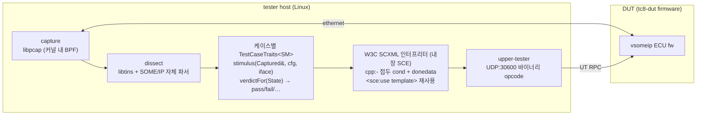
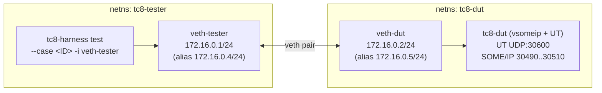
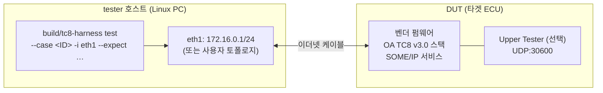

# tc8-harness
W3C SCXML 기반 자동차용 이더넷 ECU 적합성 테스트 하네스 (OA TC8 Layer 3-7)

[](https://github.com/newmassrael/tc8-harness/actions/workflows/build-test.yml) [](https://github.com/newmassrael/tc8-harness/actions/workflows/smoke-test.yml) [](https://github.com/newmassrael/tc8-harness/actions/workflows/site.yml)

**Languages**: [English](README.md) · [한국어](README.ko.md)

**케이스 브라우저**: <https://newmassrael.github.io/tc8-harness/> — 543개의 활성 케이스 각각에 대한 페이지 (설명 + 검증 접근법 + 판정 + 패킷 타임라인 + 원본 SCXML + 소스 링크), 한국어/영어 지원.

## 적용 범위

`tc8-harness`는 vsomeip 기반 DUT(ECU)가 OA TC8 v3.0 Layer 3-7에 적합한지
검증합니다 — 대상 영역은 IPv4, ARP, ICMPv4, UDP, DHCPv4 client, link-local
autoconf, TCP, SOME/IP, SOME/IP-SD. 현재 코퍼스는 **543 / 543 활성 케이스
100% 스펙 커버리지**입니다.

**적용 범위 밖** (의도적으로 제외):

- OA의 공식 TC8 인증 제출 (Vector CANoe / TTCN-3 전용 — 본 도구는 사전
  검증 + CI 회귀 도구이지 인증 패키지가 아닙니다)
- Layer 1-2 (PHY, IEEE 802.1 Qav/Qbv TSN)
- EMC / 환경 테스트
- OA TC8 v3.0 외 스펙, OEM 커스텀 단정문

## 아키텍처



각 TC8 케이스는 `tests/<case_id>/<case_id>.scxml` 한 개와, `TestCaseTraits<SM>`을
특수화하는 `src/sce_integration/cases/<case_id>.h` 한 개로 구성됩니다.
케이스 추가 = 이 두 파일만 작성하면 됩니다. 나머지(코드젠, 등록, BPF
그룹, `tests/_templates/*.sce-template.xml` 조각에 대한 빌드 의존성 추적)는
CMake가 SCE의 `--write-deps`를 통해 자동으로 처리합니다.

### 주요 기술 선택

| 레이어 | 선택 | 이유 |
|--------|------|------|
| 캡처 | **libpcap** (libtins 래퍼) | 성숙도, 이식성, 커널 내 BPF. L3-7에서는 하드웨어 타임스탬프 불필요. |
| SOME/IP 파싱 | **자체 C++ 파서** | Wireshark dissector는 GPL → Apache-2.0 + SCE LGPL 스택과 라이선스 비호환. 헤더는 50-100 LoC 수준으로 작음. |
| SOME/IP 페이로드 | **CommonAPI 생성 InputStream** | `.fidl` / `.fdepl`로 생성된 proxy 코드의 TLV / endian / alignment 로직 재사용. |
| 자극(stimulus) | **vsomeip C++ API 직접 사용** | mesh 추상화는 테스트 맥락에서 마찰 발생. vsomeip가 표준 클라이언트. |
| 오케스트레이션 | **W3C SCXML (SCE 정적 AOT)** | 케이스별 상태기계를 표준 포맷으로 작성 → C++로 AOT 컴파일. mesh 독립적. |
| 이벤트 주입 | `engine.raiseExternalEvent(...)` | SCE 표준 진입점. |
| 판정 보고 | `<final>` 상태 + `<donedata>` JSON | W3C 표준, 언어 무관. SCE의 `DoneData::getContent()`로 수집. |

### 테스트 케이스 구조

기본 경로:

```xml
<scxml xmlns="http://www.w3.org/2005/07/scxml"
       xmlns:cpp="urn:sce:cpp" version="1.0" initial="setup">

  <state id="setup">
    <onentry><send event="stimulus.fire"/></onentry>
    <transition event="stimulus.fire" target="waiting"/>
  </state>

  <state id="waiting">
    <onentry><send event="deadline_exceeded" delay="50ms"/></onentry>
    <transition event="captured.response" cond="cpp:ev.field_x == 42" target="pass"/>
    <transition event="deadline_exceeded" target="fail_timeout"/>
    <transition event="captured.response" target="fail_field"/>
  </state>

  <final id="pass"><donedata><content>{"verdict":"pass"}</content></donedata></final>
  <final id="fail_timeout"><donedata><content>{"verdict":"fail","reason":"no_response_within_50ms"}</content></donedata></final>
  <final id="fail_field"><donedata><content>{"verdict":"fail","reason":"field_x_mismatch"}</content></donedata></final>
</scxml>
```

타이밍 단정문은 관측된 이벤트와 `<send delay="…ms"/>` 기반 데드라인
이벤트 간의 전이 경합으로 표현 — W3C 표준이며 외부 스크립트 엔진의
클럭에 의존하지 않습니다.

## 개발 환경 설정

### 사전 요구사항

- C++17 툴체인 (g++ 9+ 또는 clang 12+)
- cmake 3.16+
- libpcap-dev, libtins-dev
- quilt (`sudo apt install quilt`) — vsomeip 패치 시리즈를 적용
- Boost (system / thread / filesystem / log) — vsomeip 의존성
- python3 (스펙 인벤토리 도구)

### 부트스트랩 (신규 클론)

```sh
git clone --recursive <repo-url> tc8-harness
cd tc8-harness
git config core.hooksPath .githooks    # COMMIT_FORMAT.md 검사용 in-tree commit-msg 훅 활성화
sudo ./scripts/setup-vsomeip.sh        # quilt push -a → cmake build → /usr/local 설치
cmake -B build -DTC8_SCE_FIND_PACKAGE=OFF
cmake --build build -j4
```

비-재귀 클론을 받았다면 서브모듈을 먼저 채워야 합니다:

```sh
git submodule update --init --recursive
sudo ./scripts/setup-vsomeip.sh
```

`setup-vsomeip.sh`는 `VSOMEIP_INSTALL_PREFIX` (기본 `/usr/local`)를
존중합니다. CI는 vsomeip를 CommonAPI와 함께 `/opt/someip-stack`에
배치합니다.

### vsomeip 패치 추가

하네스는 `third_party/vsomeip/`로 vsomeip를 vendoring하고 (서브모듈 3.7.1
고정), `patches/vsomeip/series`에 quilt 시리즈를 오버레이합니다. 패치
추가 방법:

```sh
cd third_party/vsomeip
export QUILT_PATCHES="$(realpath ../../patches/vsomeip)"
quilt new 0002-<short-name>.patch
quilt add <files-to-edit>
# … 파일 수정 …
quilt refresh
quilt header -e 0002-<short-name>.patch    # Subject + 본문 추가 (왜)
cd ../..
sudo ./scripts/setup-vsomeip.sh             # 재팝 → 재푸시 → 재빌드 → 재설치
```

`patches/vsomeip/0001-relax-return-code-on-requests.patch`가 패치 형식, ABI
보존 규칙, upstream 버그 설명의 레퍼런스입니다. 패치는 외과적으로
유지하세요: whitelist 확대 대신 `MT_REQUEST`로 게이팅, `MT_RESPONSE`
검증은 그대로 유지, 추적 이슈에 대한 `Refs:` 라인을 첨부.

## 토폴로지 프로필

`smoke-test.sh`는 *무엇을 테스트할지*(케이스 목록)와 *DUT가 어디에
있는지*를 토폴로지 프로필(`dut/env/topology.d/<name>.conf`, `--topology
NAME`으로 선택, 기본 `single-pc`)로 분리합니다:

| 프로필 | 테스터 | DUT | 워커 | DUT 스폰 | DUT 커널 컨디셔닝 | `--negative` |
|--------|--------|-----|------|----------|------------------|--------------|
| `single-pc` | 이 호스트의 netns | 참조 `tc8-dut`, 이 호스트의 netns | 무제한 | 케이스마다 | 가능 | 가능 |
| `external` | 이 호스트의 NIC | 이미 동작 중인 외부 장치 (target ECU, 두 번째 PC) | 1 | 안 함 — 동작 중 가정 | 불가 (로그됨) | 불가 (거부) |
| `ssh-remote` | 이 호스트의 NIC | 두 번째 Linux PC에서 SSH로 케이스마다 스폰되는 참조 `tc8-dut` | 1 | SSH로 케이스마다 | 불가 (로그됨) | 불가 (거부) |

배포 매트릭스 전체를 커버합니다: PC 1대(`single-pc`), PC↔PC
(`ssh-remote`, 또는 두 번째 PC가 자체 DUT 이미지를 돌리면
`external`), PC↔target ECU(`external`), target↔target(임베디드
Linux 테스터 *위에서* `smoke-test.sh --topology external|ssh-remote`
실행 — 통합자에게 남는 것은 바이너리 크로스빌드뿐이고 오케스트레이션은
동일).

사이트 파라미터는 `--topology-conf FILE`(`TC8_TOPOLOGY_*` 변수를
설정하는 source되는 셸 단편)로 전달합니다 — `sudo`의 `env_reset`이
NOPASSWD 규칙에서 환경 변수를 제거하기 때문입니다:

```sh
# external-dut.conf
TC8_TOPOLOGY_IFACE=eth1
TC8_TOPOLOGY_DUT_IP=192.168.10.2
TC8_TOPOLOGY_TESTER_IP=192.168.10.1

sudo ./dut/env/smoke-test.sh --topology external \
     --topology-conf external-dut.conf ICMPv4_TYPE_08 ARP_07 ...
```

프로필과 무관하게 보장되는 no-silent-failure 장치:

- **케이스 실행 전 프리플라이트**: 프로필 계약 검증(누락 훅/변수를
  전부 열거), 인터페이스 존재 + 링크 상태, DUT ICMP 도달성,
  SSH/원격 바이너리 검사(`ssh-remote`), 그리고 Upper Tester 프로브
  (`tc8-harness ut-ping` — 부작용 없는 UT `OpPing` 0x15; 응답은 DUT
  펌웨어가 구현한 최고 opcode도 보고합니다). `external`에서 UT 부재는
  기본 WARNING(`TC8_TOPOLOGY_REQUIRE_UT=1`로 치명화), `ssh-remote`는
  일시적 원격 `tc8-dut`를 스폰해 프로브하며 무응답은 원격 로그 덤프와
  함께 하드 실패입니다.
- **명시적 SKIP**: 토폴로지가 실행할 수 없는 케이스(예: 보조
  인터페이스 없는 `DHCPv4_CLIENT_USAGE_01`)는 stdout, 요약, JUnit
  (`<skipped/>`) 세 곳 모두에 사유와 함께 SKIP으로 보고됩니다 —
  오해를 부르는 timeout FAIL이 아니라.
- **컨디셔닝 투명성**: 프로필이 적용할 수 없는 케이스별
  Linux-참조-DUT 커널 컨디셔닝(sysctl/neigh)은 케이스마다 로그되어
  (`INFO ... DUT-stack conditioning not applied`), single-pc 기준선과의
  판정 차이를 실행 출력만으로 설명할 수 있습니다.
- **실행 원장(ledger)**: 요약이 처리된 케이스 수를 스케줄된 총수와
  교차 검증합니다. 도중에 죽은 워커(크래시, stdin을 삼키는 자식
  프로세스)는 깨끗한 "all cases passed" 대신 하드 FATAL이 됩니다.
- **플래그 게이트**: 프로필 능력을 벗어나는 `--negative`,
  `--dut-first`, `--workers`는 시작 시점에 사유와 함께 거부됩니다.

비기본 프로필의 자가-완결 검증 픽스처가
`dut/env/topology.d/examples/`에 있습니다 — 각각 격리된 netns로 해당
배포 형태를 재현하며(`ssh-remote` 픽스처는 전용 `sshd` 포함) 어떤 단일
머신에서도 실행 가능합니다.

`lwip-tap-fixture.conf` 예제는 한발 더 나아가 실제 임베디드 TCP/IP
스택(lwIP, `dut/lwip_dut/`)을 외부 DUT로 구동합니다 — lwIP 소켓 API
위의 Upper Tester와 플랫폼별 known-fail 레저 포함. 검증된 편차 목록과
스윕 레시피는 `dut/lwip_dut/README.md`를 참고하세요.

### 임베디드 테스터용 크로스빌드 (target↔target)

임베디드 Linux 보드에서 테스터를 돌리는 것은 토폴로지 계층을 그대로
재사용합니다(보드 위에서 `--topology external|ssh-remote`); 남는 것은
바이너리 크로스빌드입니다. 레포지토리는 툴체인 파일과, 크로스 컴파일러만
설치된 호스트에서 의존성-경량 코어(SCE 엔진 + 엔디언 민감 코드가 몰린
모든 wire 빌더 / SOME/IP 디섹터)를 크로스 컴파일하는 portability-check
모드를 제공합니다:

```sh
sudo apt-get install g++-aarch64-linux-gnu
cmake -S . -B build-aarch64 \
      -DCMAKE_TOOLCHAIN_FILE=cmake/toolchains/aarch64-linux-gnu.cmake \
      -DTC8_PORTABILITY_CHECK=ON
cmake --build build-aarch64
```

전체 `tc8-harness` / `tc8-dut` 크로스빌드는 추가로 libpcap, libtins,
boost, vsomeip, CommonAPI를 담은 arm64 sysroot가 필요합니다
(`CMAKE_SYSROOT`를 지정하고 portability 플래그를 제거) — sysroot 구성은
통합자별 환경에 종속되므로 의도적으로 이 레포 범위 밖입니다.

## 단일 컴퓨터에서 테스트하기 (Linux netns)

하네스의 주된 개발 환경은 단일 호스트의 Linux network-namespace
샌드박스입니다. 두 개의 netns (`tc8-tester`, `tc8-dut`)가 veth 페어로
연결되며, in-tree `tc8-dut` 레퍼런스 펌웨어가 DUT 네임스페이스 안에서
구동됩니다. 두 번째 머신도, 물리 ECU도 필요하지 않습니다. 이는 CI의
self-hosted `[netns]` runner가 사용하는 토폴로지와 동일합니다.

### 왜 netns인가?

netns는 각 TC8 케이스에 사설 L2 브로드캐스트 도메인과 `CAP_NET_ADMIN` /
`CAP_NET_RAW` 권한을 부여합니다 — 즉, 하네스가 raw ARP / IPv4 / TCP
프레임을 직접 빚어서 보내고, wire-level 재전송을 관측하며, 인터페이스별
sysctl을 호스트에 영향 주지 않고 토글할 수 있습니다. veth 페어는 실제
이더넷 프레이밍을 end-to-end로 보존하므로 (libpcap 캡처 + BPF 필터가
실제 NIC에서와 동일하게 동작), 단 한 가지 주의점은 veth가 전송 시 기본
`CHECKSUM_PARTIAL`을 사용한다는 점입니다 (`setup-netns.sh`가 비활성화 —
이유는 스크립트의 TX-offload 섹션 참고).

### 토폴로지

두 네임스페이스는 같은 Linux 호스트 안에 있습니다 (kernel + libpcap + libtins):



옵션: `USAGE_01` (Topology 2, `SECOND_VETH=1`) 용 두 번째 veth 페어:
`172.17.0.1/24 (veth-tester2)` ⇄ `172.17.0.2/24 (veth-dut2)`.

### 빠른 스모크 테스트 (첫 실행 권장)

`cmake --build build -j4` 빌드와 `setup-vsomeip.sh`로 패치된 vsomeip 설치가
끝났다면:

```sh
sudo ./dut/env/smoke-test.sh                       # 워커 1개, 기본 케이스 (SOMEIPSRV_FORMAT_01)
sudo ./dut/env/smoke-test.sh ARP_03 ARP_05         # 특정 케이스 한 개 이상
sudo ./dut/env/smoke-test.sh --workers 4           # 병렬 정상 케이스 묶음
sudo ./dut/env/smoke-test.sh --workers 4 --negative
                                                   # 음성(negative) 단정문 묶음
```

`smoke-test.sh`는 end-to-end로 다음을 모두 수행합니다:

1. `--workers N`개의 병렬 netns 페어 (`tc8-tester-$W` / `tc8-dut-$W`)를
   각각의 veth 페어, vsomeip 작업 디렉터리, 심볼릭 링크된 바이너리
   경로 (`/tmp/tc8-vsomeip.$$/$W/`) 와 함께 프로비저닝합니다.
2. 각 워커의 DUT 네임스페이스 안에서 `tc8-dut`를 올바른
   `VSOMEIP_CONFIGURATION` / `VSOMEIP_BASE_PATH` / `COMMONAPI_CONFIG`
   환경변수와 함께 실행합니다.
3. 대응되는 tester 네임스페이스에서 `tc8-harness test --case <id> -i
   veth-tester-$W`를 실행하고, DUT의 vsomeip 정체성(서비스/인스턴스 ID,
   포트, MAC)을 `--expect KEY=VALUE` 토큰으로 전달합니다.
4. 케이스 목록을 라운드 로빈으로 워커에 분배합니다.
5. 케이스별 타임아웃을 적용하고, 로그를 워커 작업 디렉터리(또는
   `--log-dir DIR`)에 모아두며, 녹색/적색 요약을 출력하고 실패가 하나라도
   있으면 0이 아닌 코드로 종료합니다.

워커 수는 호스트의 코어 수를 넘기지 마세요. [`-j8` 이상 빌드 병렬도
금지](#ci) 정책이 여기에도 적용됩니다 — `--workers 4`가 CI에서 검증된
상한입니다.

### 수동 진행 (단계별)

`smoke-test.sh`가 자동화하는 흐름을 직접 확인하려면 동일한 흐름을 손으로
실행해 봅니다:

```sh
# 1. 빌드 (코드 변경 시 1회).
cmake --build build -j4

# 2. 두 netns + veth 페어 프로비저닝. Idempotent — 이전 상태가 있으면 정리부터.
sudo ./dut/env/setup-netns.sh                  # 단일 페어
sudo SECOND_VETH=1 ./dut/env/setup-netns.sh    # 두 번째 페어 추가 (USAGE_01)

# 3. DUT 네임스페이스 안에서 tc8-dut를 포어그라운드로 실행.
sudo ip netns exec tc8-dut env \
    COMMONAPI_CONFIG=$(pwd)/dut/dut_service/commonapi.ini \
    VSOMEIP_CONFIGURATION=$(pwd)/dut/dut_service/vsomeip.json \
    VSOMEIP_APPLICATION_NAME=tc8-dut \
    ./build/dut/dut_service/tc8-dut

# 4. 다른 셸에서 tester 네임스페이스 안에 케이스 실행.
sudo ip netns exec tc8-tester ./build/tc8-harness test \
    --case SOMEIPSRV_FORMAT_01 -i veth-tester -t 30 \
    --expect service_id=0xF4E7 --expect instance_id=0x0001 \
    --expect major_version=1   --expect ttl=3 \
    --expect minor_version=0   --expect eventgroup_id=0x0001 \
    --expect dut_iface_ip=172.16.0.2 \
    --expect udp_port=30502 --expect tcp_port=30501 \
    --expect sd_multicast_ip=224.244.224.245

# 5. 끝났으면 정리.
sudo ./dut/env/cleanup.sh
```

위 `--expect` 세트는 `smoke-test.sh`의 `TC8_DUT_EXPECT` 그대로이며,
`dut/dut_service/vsomeip.json` + `ets.fidl`과 일치합니다. DUT를 다른
vsomeip 설정으로 교체한다면 양쪽을 함께 갱신하세요.

### 케이스 목록과 ID 규칙

```sh
./build/tc8-harness test --list-cases                       # 등록된 모든 케이스, 카테고리별 정렬
./build/tc8-harness test --list-cases --include-deprecated  # deprecated ID도 포함
./build/tc8-harness test --list-cases --vs-spec             # docs/spec/case_inventory.json 대비 커버리지 갭
./build/tc8-harness test --list-cases --vs-spec --strict    # 갭이 있으면 비-0 종료
./build/tc8-harness test --list-cases --exclude-deferred --exclude-platform-known-fail
                                                            # docs/spec/inventory_overrides.json에서
                                                            # expected:false / platform_known_fail:true 로
                                                            # 표시된 ID 제외
```

케이스 ID는 `<CATEGORY>_<NAME>_<NN>` 형식입니다 (예: `ARP_03`,
`SOMEIPSRV_FORMAT_14`, `TCP_BASICS_11`). 전체 코퍼스는 543개 활성 케이스로
100% 스펙 커버리지입니다.

### 음성 테스트 모드 (`--negative`)

`smoke-test.sh --negative`는 의도적으로 잘못된 `--expect` 토큰을 한 개
주입한(예: `arp.dut_iface_ip`를 DUT가 아닌 주소로) 큐레이션된 케이스를
실행해, SCXML이 대응되는 `fail:<reason>` final 상태에 도달하는지
확인합니다. "`expected.*` cond가 자명하게 참이 되어 어떤 DUT 동작이든
통과되는" 류의 회귀를 막아주는 가드입니다. 음성 row를 추가하려면 먼저
정상 모드에서 그 케이스가 녹색이어야 합니다 (`smoke-test.sh`의
`run_negative_case` rows).

### 병렬 워커와 격리

`--workers N` 하나로 모든 격리가 해결됩니다. 내부적으로:

| 자원                | 범위                                 | 워커별로 분리하는 이유                                              |
|---------------------|--------------------------------------|---------------------------------------------------------------------|
| netns 페어          | `tc8-tester-$W` / `tc8-dut-$W`       | 독립된 L2 브로드캐스트 도메인, ARP 캐시, sysctl 상태                |
| veth 페어           | `veth-tester-$W` / `veth-dut-$W`     | 워커당 와이어 한 개, 워커 간 pcap 누출 없음                         |
| vsomeip 스크래치    | `/tmp/tc8-vsomeip.$$/$W/`            | UDS 소켓 + routing 소켓을 워커 간에 공유할 수 없음                  |
| 심볼릭 링크 바이너리 | `…/$W/{tc8-dut,tc8-harness}`         | `/proc/PID/cmdline` 범위 `pkill`로 워커 단위 원자적 정리 가능       |
| `$WORK_ROOT`        | `/tmp/tc8-workers.$$/$W/`            | 케이스별 로그, 캡처된 DUT MAC, junit 레코드 조각                    |

PID 범위화(`.$$` 접미)는 CI runner와 로컬 개발 실행이 같은 호스트에서
상태를 공유하지 않도록 합니다. 시작 시 stale-scope GC는 owner 셸이 사라진
디렉터리를 청소합니다.

### 케이스 단위로 pcap 캡처

두 가지 방법:

- 단일 케이스: `tc8-harness test --case <ID> --pcap-dump /tmp/case.pcap` —
  BPF 적용 후의 (케이스 범위) 모든 캡처 프레임을 그 경로로 기록.
  positive 대 negative 실행 결과를 diff하기에 유용.
- 스모크 전체: `sudo ./dut/env/smoke-test.sh --log-dir /tmp/logs ...` —
  워커별 `tc8-{harness,dut}.log`를 보존. 하네스의 `--pcap-dump`는 스모크
  기본값이 아니므로, 단일 케이스에 추가 인자를 전달하려면 위치 인자
  분리자를 사용: `./dut/env/smoke-test.sh ARP_03 -- --pcap-dump
  /tmp/arp_03.pcap`.

### CI 소비용 JUnit XML

```sh
sudo ./dut/env/smoke-test.sh --workers 4 --junit-xml /tmp/tc8-smoke.xml
```

`dorny/test-reporter`(및 GitLab / Jenkins surefire collector)가 그대로
소비할 수 있는 Surefire 형태의 `<testsuites><testsuite><testcase>` 문서를
생성합니다. 워커별 조각은 `wait` 직후 합쳐지므로, 워커 N이 실패해도 워커
M의 레코드는 XML에 그대로 들어갑니다.

### 자주 만나는 함정

| 증상                                                                     | 원인                                                                                              | 해결                                                                                                       |
|--------------------------------------------------------------------------|----------------------------------------------------------------------------------------------------|------------------------------------------------------------------------------------------------------------|
| `setup-netns.sh` 도중 `tester→dut ping failed`                            | 이전 크래시로 남은 stale veth                                                                      | `cleanup.sh` 재실행. 그래도 안 되면 `sudo ip link del veth-tester` 후 재시도                              |
| 새 netns 뒤 첫 케이스가 ~5 s 지연                                         | Linux의 STALE→DELAY→PROBE (DUT 측 neigh 엔트리)                                                   | `setup-netns.sh`가 이미 `delay_first_probe_time=30`로 확대. 추가 조치 불필요                              |
| `--workers 4` 스모크가 TCP 재전송 타이밍 케이스에서 flaky                  | 부하 상태에서 pcap delivery jitter                                                                 | 해당 케이스(RETRANSMISSION_TO_03..06)는 커널-측 `OpQueryTcpInfo`로 이전됨 — jitter 영향 없음              |
| 커널 업데이트 후 vsomeip 클라이언트가 서로를 찾지 못함                    | `/tmp/tc8-vsomeip.$$`의 UDS / shm 잔여물                                                          | 스크래치가 PID 범위이므로, smoke-test.sh를 재실행하면 새 PID dir이 만들어짐                               |
| `quilt push -a`가 종료 코드 2                                              | 이전 서브모듈 동기화 후 `.pc/` 잔재                                                                | `setup-vsomeip.sh`는 먼저 `.pc/`를 삭제. quilt를 손으로 돌렸다면 `rm -rf third_party/vsomeip/.pc` 후 재시도 |
| `--negative` row가 실패를 예상하는데 통과해버림                            | `expected.*` cond가 자명하게 참이 됨                                                              | 정확히 `--negative`가 잡으려는 회귀 — 해당 SCXML cond를 수정                                              |

## 실제 타겟 ECU에서 테스트하기

이 하네스는 SCXML 케이스가 *호스트 또는 펌웨어 동작*이 아닌 *와이어
동작*을 기술하도록 설계되어 있습니다. 따라서 실제 ECU를 대상으로
가리키는 일은 코드 변경이 아니라 설정 변경입니다: `tc8-dut`를 타겟
펌웨어로 바꾸고, veth 페어를 물리 NIC로 바꾸며, DUT별 `--expect` 토큰을
공급하면 됩니다.

### 토폴로지



tester는 netns 케이스와 *정확히 동일한* `tc8-harness` 바이너리를
실행합니다. 개념적으로 바뀌는 것은 DUT뿐입니다: `tc8-dut` 펌웨어가
`tc8-dut` netns에서 도는 대신, DUT는 와이어 너머에 있는 별도 장비가
됩니다.

### Tester 호스트 설정

tester 호스트에서 root 권한(또는 `CAP_NET_ADMIN` + `CAP_NET_RAW`를 가진
사용자)으로 실행합니다.

```sh
# 1. 전용 tester NIC 선택. 하네스는 libpcap promiscuous + BPF로 NIC을 엽니다.
#    공존 트래픽이 있어도 동작은 하지만, 격리된 결선이 판정을 결정적으로 만들어 줍니다.
TESTER_IF=eth1

# 2. tester IP 구성. DUT에 할당한 서브넷에 맞춥니다.
sudo ip link set "$TESTER_IF" up
sudo ip addr add 172.16.0.1/24 dev "$TESTER_IF"

# 3. SOME/IP-SD 멀티캐스트 경로 추가 (vsomeip 기본 그룹).
sudo ip route add 224.0.0.0/4 dev "$TESTER_IF"

# 4. TX 체크섬 오프로드 비활성화. 와이어가 최종 L4 체크섬을 운반해야
#    TCP_CHECKSUM_03 등이 검증을 단정할 수 있습니다.
sudo ethtool -K "$TESTER_IF" tx off

# 5. 커널-측 unicast NUD_PROBE 억제. ARP §4.2.4.2 absence 윈도 동안
#    tester 커널이 DUT를 향해 unicast ARP 프로브를 쏘면 SCXML 가드와
#    경합이 발생합니다.
sudo sysctl -w "net.ipv4.neigh.${TESTER_IF}.ucast_solicit=0"

# 6. DUT MAC을 tester에 영구 고정. <DUT_MAC>을 실제 값으로 교체.
#    이렇게 하지 않으면 tester 커널이 "DUT가 자신의 Request를 송신"하는
#    pass-guard와 경합할 수 있습니다 (ARP_07..15, Group C).
sudo ip neigh replace 172.16.0.2 lladdr <DUT_MAC> nud permanent dev "$TESTER_IF"
```

4–6단계는 `setup-netns.sh`가 `tc8-tester` 네임스페이스 안에 이미
적용하는 노브를 그대로 미러링한 것입니다. 이 노브들은 ARP / TCP를
녹색으로 만들기 위해 필요하며 스펙 위반이 아닙니다 — 스펙 단정문은 DUT
동작에 관한 것이고, tester-측 노브는 tester 커널이 자체적인 충돌
트래픽을 만들지 않도록 막는 역할만 합니다.

### DUT 측 요구사항

TC8 카테고리별로 DUT가 갖춰야 할 능력:

| 카테고리                                  | 필요 능력                                                                                              |
|-------------------------------------------|--------------------------------------------------------------------------------------------------------|
| §4.2 ARP                                  | RFC 826 ARP 응답기, 고정 IP 설정 가능                                                                  |
| §4.3 ICMPv4                               | RFC 792 echo / unreachable / parameter-problem / timestamp, PACKET_HOST 게이팅 정확                    |
| §4.4 IPv4                                 | RFC 791 forwarding / options / reassembly, ADDRESSING_01/02 + FRAGMENTS_05용 UT                        |
| §4.5 IPv4 Link-Local                      | RFC 3927 PROBE / ANNOUNCE / CONFLICT, §4.5 케이스용 UT (`OpStartLLAutoconf`, `OpAbortLLAutoconf`)      |
| §4.6 UDP                                  | RFC 768, 호출자 지정 Source/Destination IP(UI_07/_08) + 수신 포트 개수(UI_01) 케이스용 UT              |
| §4.7 DHCPv4 client                        | RFC 2131 INIT → SELECTING → REQUESTING → BOUND → RENEWING → REBINDING, `OpStartDhcpClient` 등 UT       |
| §4.8 TCP                                  | RFC 793 + 6298 + 1122, open/close/send/recv/abort/TCP_INFO 용 UT (`OpOpenTcpSocket` …)                 |
| §5.1.5 SOMEIPSRV (SD + format)            | vsomeip 호환 SOME/IP-SD, OfferService/FindService/SubscribeEventgroup/IPv4 Endpoint Options            |
| §5.1.6 SOMEIP_ETS                         | `dut/ets/`에 열거된 메서드들을 노출하는 SOME/IP 서비스                                                 |

와이어-전용 카테고리(ARP / ICMPv4 / IPv4 / TCP basics / SOMEIPSRV /
SOMEIP_ETS)는 Upper Tester가 필요하지 않습니다. 적합한 DUT를 연결하고
케이스를 돌리면 됩니다 — 판정은 관측된 프레임만으로 도출됩니다.

### 어떤 케이스가 Upper Tester를 요구하나?

Upper Tester(UT)는 UDP:30600 위의 tester가 발급하는 RPC 채널입니다. TC8
§4.8.5는 "별도 UDP 포트"를 요구하면서 와이어 포맷은 비특정으로 남깁니다
— 본 하네스는 `include/tc8/upper_tester_protocol.h`에 20개 opcode의
바이너리 프로토콜을 정의했습니다. 타겟 ECU가 UT를 구현하지 않더라도
대부분의 코퍼스는 그대로 돌릴 수 있습니다.

| TC8 하위 영역                       | UT 필요? | 사용 opcode                                                                                                                                                                                                       | UT 미구현 시 대응                                                                                       |
|-------------------------------------|----------|-------------------------------------------------------------------------------------------------------------------------------------------------------------------------------------------------------------------|----------------------------------------------------------------------------------------------------------|
| §4.2 ARP                             | 아니오   | —                                                                                                                                                                                                                  | 별도 조치 없음 — RFC 826 응답기가 있으면 동작                                                            |
| §4.3 ICMPv4                          | 아니오   | —                                                                                                                                                                                                                  | 별도 조치 없음                                                                                            |
| §4.4 IPv4 (HEADER / FRAGMENTS 대부분) | 부분     | `OpTriggerSendUdp`, `OpGetReceivedUdp` (ADDRESSING_01/02 + FRAGMENTS_05용)                                                                                                                                          | 두 opcode만 구현하면 30개 중 ~25개 동작                                                                  |
| §4.5 IPv4 Link-Local                 | 예       | `OpStartLLAutoconf`, `OpStartLLAutoconfBuggy`, `OpQueryLLAddress`, `OpAbortLLAutoconf`                                                                                                                              | opcode 0x0C…0x0F 구현, 또는 `--exclude-linux-known-fail` 식으로 클러스터 스킵                            |
| §4.6 UDP                             | 대체로 아니오 | `OpCreateUdpReceivePorts` (UI_01), `OpTriggerSendUdp` (UI_07/_08)                                                                                                                                                  | 해당 세 row를 위해 0x02 / 0x14만 구현, 나머지는 와이어-전용                                              |
| §4.7 DHCPv4 client                   | 예       | `OpStartDhcpClient`, `OpQueryDhcpLease`, `OpAbortDhcpClient`                                                                                                                                                       | opcode 0x10…0x12를 DUT의 DHCP 클라이언트와 연결                                                          |
| §4.8 TCP basics / closing / RTO      | 예       | `OpOpenTcpSocket`, `OpCloseTcpSocket`, `OpQueryTcpEstablished`, `OpSendTcpData`, `OpReceiveTcpData`, `OpShutdownTcpSocketWr`, `OpAbortTcpSocket`, `OpSendTcpDataPattern`, `OpReceiveTcpDataOob`, `OpQueryTcpInfo` | opcode 0x03…0x0B + 0x13 구현                                                                              |
| §5.1.5 SOMEIPSRV                     | 아니오   | —                                                                                                                                                                                                                  | vsomeip 호환 서비스이면 동작                                                                              |
| §5.1.6 SOMEIP_ETS                    | 아니오   | —                                                                                                                                                                                                                  | ETS 메서드 세트를 노출하는 서비스이면 동작 — UT 왕복 없음                                                |

각 opcode의 정확한 와이어 포맷은 `include/tc8/upper_tester_protocol.h`를
참조하세요 (모든 opcode 주석이 해당 TC8 §을 인용합니다).
`dut/dut_service/upper_tester_server.cpp`가 레퍼런스 Linux 구현입니다 —
디스패치 루프와 opcode별 본문을 타겟 ECU의 RTOS / lwIP 등에 이식하면
됩니다. 전송은 DUT IP의 30600 포트로 UDP unicast이며, SOME/IP 프레이밍은
없습니다.

### 실행 불가능한 클러스터 스킵

`docs/spec/inventory_overrides.json`은 두 축을 가집니다:

- `expected: false` — 케이스가 이연된(deferred) 상태 (이번 릴리스 범위
  밖, 추후 세션, 또는 해당 overrides 파일의 대상 DUT에서 구현 불가).
- `platform_known_fail: true` — 해당 overrides 파일의 대상 DUT 플랫폼이
  가진 RFC 일탈 때문에 케이스가 실패하는 경우 (기본 파일은 Linux 레퍼런스
  DUT를 기술). strict-RFC DUT라면 통과합니다.

DUT 플랫폼마다 overrides 파일 하나를 소유합니다: 기본
`docs/spec/inventory_overrides.json`은 Linux 레퍼런스 DUT를 기술하고,
`--inventory-overrides PATH`로 다른 플랫폼의 파일(예: OEM 타겟 ECU,
레포 내 lwIP 픽스처)을 선택합니다.

`--list-cases --exclude-platform-known-fail`은 활성 overrides 파일의
known-fail 집합을 리스팅에서 제외합니다 — 하네스를 다른 타겟에 가리키고
DUT가 통과해야 할 케이스만 보고 싶을 때 유용합니다. 전체 CI-스모크 스킵
목록을 얻으려면 `--exclude-deferred`와 함께 쓰세요.

### 실제 DUT에 단일 케이스 실행

```sh
sudo ./build/tc8-harness test \
    --case SOMEIPSRV_FORMAT_01 -i eth1 -t 30 \
    --expect service_id=0xABCD \
    --expect instance_id=0x0010 \
    --expect major_version=2 \
    --expect ttl=5 \
    --expect minor_version=0 \
    --expect eventgroup_id=0x0001 \
    --expect dut_iface_ip=172.16.0.2 \
    --expect udp_port=30502 \
    --expect tcp_port=30501 \
    --expect sd_multicast_ip=224.244.224.245 \
    --pcap-dump /tmp/dut_format_01.pcap
```

필수 플래그:

- `-i / --interface` — tester NIC 이름
- `--case / -c` — 단일 케이스 ID

필수 `--expect` 키는 케이스에 따라 다릅니다. 기본 `--expect` 값은
`dut/dut_service/vsomeip.json`과 `dut/ets/ets.fidl`에서 옵니다
(`smoke-test.sh`의 `TC8_DUT_EXPECT` 참고). 서드파티 DUT에 대해서는 자체
SD 설정에서 값을 가져오세요:

| `--expect KEY=VALUE`             | 출처                                                                                                  |
|----------------------------------|-------------------------------------------------------------------------------------------------------|
| `service_id`                     | OfferService Service-ID 필드                                                                          |
| `instance_id`                    | OfferService Instance-ID 필드                                                                         |
| `major_version` / `minor_version`| OfferService Major / Minor                                                                            |
| `ttl`                            | OfferService Entry TTL                                                                                |
| `eventgroup_id`                  | SubscribeEventgroup Eventgroup-ID                                                                     |
| `dut_iface_ip`                   | DUT IPv4 Endpoint Option 주소                                                                         |
| `udp_port` / `tcp_port`          | DUT IPv4 Endpoint Option UDP / TCP 포트                                                               |
| `sd_multicast_ip`                | DUT가 FindService에 응답하는 SD 멀티캐스트 그룹 (vsomeip `service-discovery.multicast`)              |
| `mcast_ipv4` / `mcast_port`      | 멀티캐스트 이벤트그룹 옵션 주소 / 포트 (OPTIONS_11/14 에서만 사용)                                    |
| `arp.dut_iface_ip` / `…_mac` / `arp.tester_ip` / `arp.tester_mac` | ARP §4.2 판정 리터럴 (`smoke-test.sh`의 ARP_* 그룹 참조)                            |

알아두면 좋은 다른 플래그:

- `--stimulus-wait 1500 --stimulus-retry 1000 --stimulus-emits 2` — 부트
  시퀀스 페이싱. tc8-dut의 vsomeip 부트스트랩은 ~1 s 정도. DUT의 SD
  `initial_delay`가 더 길다면(예: AUTOSAR PDU 스택은 종종 >2 s 대기)
  값을 늘리세요.
- `-t / --timeout` — 케이스당 wall-clock 상한 (기본 30 s). TIME-WAIT
  종료처럼 ~60 s wall이 의도된 케이스는 늘리세요.
- `--interface-secondary veth-tester2` — Topology 2 두 번째 인터페이스
  (`USAGE_01` 만 사용).

### 라이브 모니터 모드

```sh
sudo ./build/tc8-harness live -i eth1
```

NIC를 pcap-promiscuous로 열고 기본 SOME/IP BPF 필터(`bpf::someip()`)를
적용합니다. 케이스를 돌리기 전에 와이어 상태를 점검하는 데 유용 — DUT의
SD `cyclic_offer_delay` 주기로 OfferService 알림이 순환하는 게 보여야
합니다. 더 좁힌 필터를 쓰려면 `-f`로 BPF를 덮어쓰세요. 관찰 전용이며
SCXML도 판정도 없습니다.

### 오프라인 pcap 재생

```sh
./build/tc8-harness replay /tmp/captured.pcap
```

기존 pcap을 같은 디섹션 / 디스패치 파이프라인에 통과시킵니다. 실패 중인
케이스를 오프라인으로 분류할 때 유용 — 한 번 `--pcap-dump`로 캡처해두면
DUT를 다시 자극하지 않고 수정된 SCXML 가드에 대해 재생할 수 있습니다.
`--case` 플래그는 없습니다 — 재생은 live-capture와 같은 형태(디섹션 +
콘솔 로그)이며 테스트 케이스 판정은 수행하지 않습니다.

### 일회성 DUT 이미지 빌드

in-tree `tc8-dut`가 레퍼런스 Linux 펌웨어입니다. 하네스를 빌드할 때 CMake가
무조건 함께 빌드합니다:

```sh
ls build/dut/dut_service/tc8-dut    # 펌웨어 바이너리
```

임베디드 타겟으로 크로스 컴파일하려면 평소대로 CMake를 툴체인 파일로
가리키세요. `tc8-dut` 자체가 vsomeip, CommonAPI, Boost에 의존하므로 이들을
먼저 타겟용으로 빌드해 두어야 합니다.

### 실제 DUT를 향한 빠른 스모크

DUT가 와이어-전용 카테고리만 필요로 한다면(ARP / ICMPv4 / IPv4 / SOMEIPSRV
대부분), 가장 빠른 검증 경로는:

```sh
# 1. UT가 필요 없고 Linux-DUT 타협이 없는 케이스 목록.
./build/tc8-harness test --list-cases \
    --exclude-deferred --exclude-linux-known-fail \
    > /tmp/runnable.txt

# 2. 케이스를 순차적으로 실행. (인터페이스와 --expect 세트는 환경에 맞춰서.)
while read CASE_ID; do
    sudo ./build/tc8-harness test --case "$CASE_ID" -i eth1 -t 30 \
        --expect service_id=0xABCD --expect …
done < /tmp/runnable.txt
```

UT를 구현한 DUT라면 `smoke-test.sh`도 적응시킬 수 있습니다 —
`setup-netns.sh` 호출을 제거하고, 워커별 veth 이름을 물리 NIC로 바꾸고,
`ip netns exec` 래퍼를 제거하세요. 형태는 동일합니다.

## tc8-harness 임베딩 (out-of-tree OEM 케이스)

tc8-harness는 포크 없이 고정 버전 의존성으로 소비할 수 있습니다 —
FetchContent, git 서브모듈, 벤더링 스냅샷 모두 가능합니다. 두 CMake
캐시 변수가 소스 트리 밖에서 케이스를 주입합니다:

| 변수 | 의미 |
|------|------|
| `TC8_EXTRA_CASE_DIRS` | `;` 구분 디렉토리 목록. 각 디렉토리는 `tests/<case_id>/` 형태의 **신규** 케이스 서브디렉토리를 담습니다. in-tree 케이스와 이름이 충돌하면 configure 에러입니다. |
| `TC8_CASE_OVERRIDE_DIRS` | `;` 구분 디렉토리 목록. 케이스 서브디렉토리가 같은 이름의 in-tree `tests/<case_id>/`를 **대체**합니다. 일치하는 in-tree 케이스가 없으면 configure 에러입니다. |

수집된 모든 케이스의 traits 헤더는 `<case_dir>/<case_id>.h`를 먼저
찾고, 없으면 `src/sce_integration/cases/<case_id>.h`로 폴백합니다.
따라서:

- **SCXML-only 오버라이드** — `<id>.scxml`만 배치하면 in-tree traits
  (stimulus, BPF 그룹, verdict 문자열)가 재사용됩니다. DUT 동작이
  in-tree 가정과 다를 때 판정 조건만 조정하는 용도입니다.
- **전체 교체 / 신규 케이스** — `<id>.scxml` + `<id>.h`를 함께
  배치합니다. out-of-tree traits 헤더도 in-tree 케이스와 같은 include
  경로(`src/`, `include/`)를 보므로 trait 베이스, stimulus 빌더,
  `TC8_REGISTER_CASE()` 레지스트라를 그대로 재사용할 수 있습니다.

대체는 codegen 이전의 수집 단계에서 일어나므로 케이스 id당 정확히
하나의 상태머신만 링크에 도달합니다 — 레지스트리의 중복-id abort는
메커니즘이 아니라 안전망으로 남습니다.

소비자 슈퍼프로젝트 스케치:

```cmake
include(FetchContent)
FetchContent_Declare(tc8-harness
    GIT_REPOSITORY <upstream-url>
    GIT_TAG        <pinned-tag>)
set(TC8_EXTRA_CASE_DIRS    ${CMAKE_CURRENT_SOURCE_DIR}/oem_cases)
set(TC8_CASE_OVERRIDE_DIRS ${CMAKE_CURRENT_SOURCE_DIR}/oem_overrides)
FetchContent_MakeAvailable(tc8-harness)
```

```
oem-conformance/            # OEM 레포지토리
├── CMakeLists.txt          # 위 스케치
├── oem_cases/
│   └── oemx_link_01/
│       ├── oemx_link_01.scxml
│       └── oemx_link_01.h  # traits — 신규 케이스는 필수
└── oem_overrides/
    └── arp_03/
        └── arp_03.scxml    # SCXML-only — in-tree traits 재사용
```

케이스 id는 `<CATEGORY>_<digits>` 형식을 유지해야 하고(컴파일 타임
assert) 디렉토리 이름은 소문자입니다 — `OEMX_LINK_01` 같은 OEM
카테고리는 `--list-cases` 출력에서 자연스럽게 그룹핑됩니다. 스펙
커버리지 집계는 영향받지 않습니다: `--vs-spec`은
`docs/spec/case_inventory.json` 기준으로 비교하므로 OEM 확장 케이스는
집계에 끼어들지 않고, OEM별 스킵/known-fail 정책은 OEM이 관리하는
JSON을 `--inventory-overrides` 플래그로 태우면 됩니다.

### IEEE 802.1Q VLAN 태깅

TC8 v3.0에는 VLAN 케이스가 없지만, 차량 이더넷 OEM 프로파일은 흔히
트래픽을 태깅합니다(AUTOSAR `EthIf`). 하네스는 코어 수정 없이 단일
태그(C-TAG, TPID 0x8100) 프레임을 관측·주입할 수 있도록 엔드투엔드로
VLAN-투명합니다:

- **관측** — 디서가 프레임당 한 번 태그를 디코드하여 모든 L2 프레임 변종
  (`ArpFrame`/`Ipv4Frame`/`Icmpv4Frame`/`UdpFrame`/`Dhcpv4Frame`/`TcpFrame`)에
  `Dot1QTag vlan` 필드로 노출합니다. out-of-tree 케이스의 `cpp:` cond가
  `frame.vlan.present`/`frame.vlan.vid`/`frame.vlan.pcp`를 읽습니다. 내부
  프로토콜은 태그 유무와 무관하게 디코드됩니다(libtins가 태그를 관통).
- **주입** — `tc8::stimulus::withDot1QTag(frame, pcp, dei, vid)`가 빌드된
  이더넷 프레임에 태그를 splice하며 `sendRawEthernet`과 그대로 합성됩니다.
  와이어 레이아웃은 디코더와 공유되고(`include/tc8/protocol_frames/dot1q_tag.h`)
  라운드트립 유닛 테스트로 핀됩니다.
- **캡처 필터** — 모든 `BpfGroup` 필터가 `(<expr>) or (vlan and (<expr>))`로
  감싸져, 태그된 프레임이 커널 BPF에서 조용히 누락되지 않습니다(plain 술어는
  태그가 시프트하는 고정 오프셋에서 L3 필드를 읽음). `-f/--bpf` override는
  verbatim 전달되며 재래핑되지 않습니다.
- **토폴로지** — `VLAN_ID` 설정 시(기본 off) `setup-netns.sh`가 VLAN
  서브인터페이스를 쌓고 L3를 그 위에 둡니다. `single-pc.conf`가 `VLAN_ID`를
  전달합니다. 하네스는 **bare veth**에서 캡처하여 태그가 보이도록 유지하고
  (서브인터페이스에서의 libpcap은 커널이 태그를 벗긴 것을 봄), 커널-소켓
  stimulus와 DUT egress는 주소가 서브인터페이스에 있으므로 태깅됩니다.

실 NIC에서는 RX VLAN offload를 끄세요(`ethtool -K <dev> rxvlan off`). 그래야
태그가 패킷 메타데이터로 벗겨지지 않고 in-band로 libpcap에 도달합니다.

## CI

`.github/workflows/` 아래 두 워크플로가 테스트 매트릭스의 직교 슬라이스를
담당합니다:

| 워크플로                 | runner                  | 범위                                                                                                                       |
| ------------------------ | ----------------------- | -------------------------------------------------------------------------------------------------------------------------- |
| `build-test.yml`         | `ubuntu-22.04` (hosted) | 서브모듈 init → `setup-vsomeip.sh` (patched) + CommonAPI → `cmake build` → `ctest` → `--list-cases --vs-spec` 드리프트 게이트  |
| `smoke-test.yml`         | self-hosted `[netns]`   | `setup-vsomeip.sh` (idempotent 재팝/푸시) → 하네스 빌드 → `dut/env/smoke-test.sh --workers 4` (정상 + `--negative`)         |

두 워크플로 모두 `actions/checkout@v4`에 `submodules: recursive`를 전달해
빌드 단계 전에 `third_party/vsomeip`가 채워지도록 합니다. hosted 빌드는
`/opt/someip-stack`을 패치 시리즈 + 서브모듈 SHA로 키를 잡아 캐시합니다
— `patches/vsomeip/*` 변경은 캐시를 무효화합니다.

### Self-hosted runner (`[netns]` 라벨)

스모크 스위트는 워커별 veth 페어 netns 격리를 사용하므로 root와
`CAP_NET_ADMIN`/`CAP_NET_RAW`가 필요합니다. GitHub-hosted runner는 이를
제공하지 못합니다. 호스트별 1회 self-hosted runner를 프로비저닝:

```bash
# 1. /opt/actions-runner에 actions runner 설치 (GitHub 공식 문서 기준)
# 2. 등록 시 [self-hosted, netns] 라벨 적용
# 3. 빌드 의존성 설치 (cmake, build-essential, quilt, libpcap-dev,
#    libtins-dev, libboost-{system,thread,filesystem,log}-dev)
# 4. runner가 smoke-test.sh와 setup-vsomeip.sh를 비대화식으로 돌릴 수
#    있도록 sudoers fragment 추가 (후자의 `sudo cmake --install`는
#    root→root이므로 별도 항목 불필요):
sudo tee /etc/sudoers.d/tc8-runner <<'EOF'
%docker ALL=(root) NOPASSWD: /opt/actions-runner/_work/tc8-harness/tc8-harness/dut/env/smoke-test.sh
%docker ALL=(root) NOPASSWD: /opt/actions-runner/_work/tc8-harness/tc8-harness/scripts/setup-vsomeip.sh
EOF
# 5. `sudo systemctl enable --now actions.runner.<owner>-<repo>.<runner-name>.service`
```

하네스의 스펙 커버리지 게이트(`--list-cases --vs-spec --strict`)는
`build-test.yml`에서 동작합니다. 추후 세션에 큐잉된 ~235개 §4.6 UDP /
§5 SOMEIP 케이스 때문에 지금은 비-0 종료를 내며, 팀이 게이트를 hard로
넘길 때까지 CI 스텝은 `continue-on-error: true`로 감싸져 있습니다.
Wall-time 이연 케이스(`TCP_RETRANSMISSION_TO_08/_09`)는 이미
`docs/spec/inventory_overrides.json`을 통해 필터됩니다.

## 라이선스

`tc8-harness`는 [Apache License 2.0](LICENSE) 아래 라이선스됩니다.

서드파티 컴포넌트는 자체 라이선스로 트리 내에 포함됩니다:

| 컴포넌트 | 위치 | 라이선스 |
| --------- | ---- | -------- |
| SCE (SCXML Core Engine) | `third_party/sce/` | LGPL-2.1+ WITH SCE-Linking-Exception OR SCE-Commercial (`third_party/sce/LICENSE*`) |
| pugixml (SCE 경유 vendored) | `third_party/sce/third_party/pugixml/` | MIT (`LICENSE.md`) |
| nlohmann/json (SCE 경유 vendored) | `third_party/sce/third_party/nlohmann_json/` | MIT (`third_party/sce/LICENSE-THIRD-PARTY.md`로 커버) |
| CLI11 | `third_party/CLI11/` | BSD-3-Clause (`LICENSE`) |
| vsomeip (서브모듈) | `third_party/vsomeip/` | MPL-2.0 (`third_party/vsomeip/LICENSE`); `patches/vsomeip/`의 하네스 패치는 MPL-2.0 상속 유지 |

런타임 의존성(libpcap, libtins, Boost, CommonAPI)은 시스템에서 링크되거나
`scripts/setup-vsomeip.sh` + build-test 워크플로가 upstream 소스에서
빌드합니다. 라이선스는 각 프로젝트를 확인하세요.
