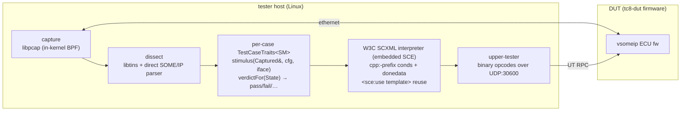
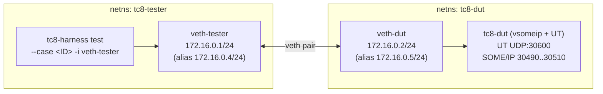
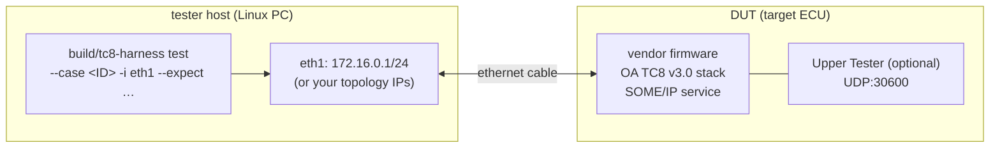

# tc8-harness
W3C SCXML-based conformance test harness for automotive Ethernet ECUs (OA TC8 Layer 3-7)

[](https://github.com/newmassrael/tc8-harness/actions/workflows/build-test.yml) [](https://github.com/newmassrael/tc8-harness/actions/workflows/smoke-test.yml) [](https://github.com/newmassrael/tc8-harness/actions/workflows/site.yml)

**Languages**: [English](README.md) · [한국어](README.ko.md)

**Case browser**: <https://newmassrael.github.io/tc8-harness/> — per-case page for all 543 active cases (description + test approach + verdicts + packet timeline + raw SCXML + source links), in English and Korean.

## Scope

`tc8-harness` verifies that a vsomeip-based DUT (ECU) conforms to OA
TC8 v3.0 Layer 3-7 — IPv4, ARP, ICMPv4, UDP, DHCPv4 client, link-local
autoconf, TCP, SOME/IP, SOME/IP-SD. The current corpus is **543 / 543
active cases** at 100 % spec coverage.

**Non-goals** (out of scope by design):

- Submission for OA's official TC8 certification (Vector CANoe / TTCN-3
  only — this is a pre-qualification + CI-regression tool, not a
  certification package).
- Layers 1-2 (PHY, IEEE 802.1 Qav/Qbv TSN).
- EMC / environmental testing.
- Specs other than OA TC8 v3.0, OEM-custom assertions.

## Architecture



Each TC8 case lives at `tests/<case_id>/<case_id>.scxml` plus a
matching `src/sce_integration/cases/<case_id>.h` that specialises
`TestCaseTraits<SM>`. Adding a case = those two files. CMake auto-wires
the rest (codegen, registration, BPF group, build dependency on
`tests/_templates/*.sce-template.xml` fragments via SCE's
`--write-deps`).

### Key technology choices

| Layer | Choice | Why |
|-------|--------|-----|
| Capture | **libpcap** (libtins thin wrapper) | mature, portable, in-kernel BPF; hardware timestamps not needed at L3-7. |
| SOME/IP dissect | **direct C++ parser** | Wireshark dissector is GPL → incompatible with our Apache-2.0 + SCE LGPL-with-linking-exception stack. Header is small (50-100 LoC). |
| SOME/IP payload | **CommonAPI generated InputStream** | reuses TLV/endian/alignment baked into `.fidl`/`.fdepl`-driven proxy code. |
| Stimulus | **vsomeip C++ API directly** | mesh abstraction adds friction in test context; vsomeip is the canonical client. |
| Orchestration | **W3C SCXML via SCE static AOT** | per-case state machine in standard format, AOT-compiled to C++; mesh-independent. |
| Test event injection | `engine.raiseExternalEvent(...)` | standard SCE entry point. |
| Verdict reporting | `<final>` state + `<donedata>` JSON | W3C-standard, language-agnostic; collected via SCE's `DoneData::getContent()`. |

### Test case shape

Happy path:

```xml
<scxml xmlns="http://www.w3.org/2005/07/scxml"
       xmlns:cpp="urn:sce:cpp" version="1.0" initial="setup">

  <state id="setup">
    <onentry><send event="stimulus.fire"/></onentry>
    <transition event="stimulus.fire" target="waiting"/>
  </state>

  <state id="waiting">
    <onentry><send event="deadline_exceeded" delay="50ms"/></onentry>
    <transition event="captured.response" cond="cpp:ev.field_x == 42" target="pass"/>
    <transition event="deadline_exceeded" target="fail_timeout"/>
    <transition event="captured.response" target="fail_field"/>
  </state>

  <final id="pass"><donedata><content>{"verdict":"pass"}</content></donedata></final>
  <final id="fail_timeout"><donedata><content>{"verdict":"fail","reason":"no_response_within_50ms"}</content></donedata></final>
  <final id="fail_field"><donedata><content>{"verdict":"fail","reason":"field_x_mismatch"}</content></donedata></final>
</scxml>
```

Timing assertions piggyback on transition races between the observed
event and a `<send delay="…ms"/>`-driven deadline event — W3C-standard,
no script-engine clock dependency.

## Development Setup

### Prerequisites

- C++17 toolchain (g++ 9+ or clang 12+)
- cmake 3.16+
- libpcap-dev, libtins-dev
- quilt (`sudo apt install quilt`) — drives the vsomeip patch series
- Boost (system / thread / filesystem / log) — vsomeip dependency
- python3 (spec inventory tooling)

### Bootstrap (fresh clone)

```sh
git clone --recursive <repo-url> tc8-harness
cd tc8-harness
git config core.hooksPath .githooks    # enable in-tree commit-msg validator (COMMIT_FORMAT.md)
sudo ./scripts/setup-vsomeip.sh        # quilt push -a → cmake build → install to /usr/local
cmake -B build -DTC8_SCE_FIND_PACKAGE=OFF
cmake --build build -j4
```

If the clone is non-recursive, populate the submodule first:

```sh
git submodule update --init --recursive
sudo ./scripts/setup-vsomeip.sh
```

`setup-vsomeip.sh` honours `VSOMEIP_INSTALL_PREFIX` (default `/usr/local`)
so CI can co-locate vsomeip with CommonAPI under `/opt/someip-stack`.

### Adding a vsomeip patch

The harness vendors vsomeip via `third_party/vsomeip/` (submodule pinned to
3.7.1) and overlays a quilt series at `patches/vsomeip/series`. To add a
patch:

```sh
cd third_party/vsomeip
export QUILT_PATCHES="$(realpath ../../patches/vsomeip)"
quilt new 0002-<short-name>.patch
quilt add <files-to-edit>
# … edit files …
quilt refresh
quilt header -e 0002-<short-name>.patch    # add Subject + body explaining why
cd ../..
sudo ./scripts/setup-vsomeip.sh             # re-pop, re-push, rebuild, reinstall
```

`patches/vsomeip/0001-relax-return-code-on-requests.patch` is the
reference for patch shape, ABI-preservation rules, and upstream-bug
narration. Keep patches surgical: gate by `MT_REQUEST` rather than
broaden whitelists, leave `MT_RESPONSE` validation intact, attach a
`Refs:` line to a tracking issue.

## Topology profiles

`smoke-test.sh` separates *what to test* (case list) from *where the DUT
lives* through topology profiles (`dut/env/topology.d/<name>.conf`,
selected with `--topology NAME`; default `single-pc`):

| Profile | Tester | DUT | Workers | DUT spawn | DUT kernel conditioning | `--negative` |
|---------|--------|-----|---------|-----------|------------------------|--------------|
| `single-pc` | netns on this host | reference `tc8-dut`, netns on this host | unlimited | per case | yes | yes |
| `external` | this host's NIC | persistent external device (target ECU, second PC) | 1 | no — assumed running | no (logged) | no (rejected) |
| `ssh-remote` | this host's NIC | reference `tc8-dut` spawned per case on a second Linux PC over SSH | 1 | per case via SSH | no (logged) | no (rejected) |

This covers the deployment matrix: one PC (`single-pc`), PC↔PC
(`ssh-remote`, or `external` when the second PC runs its own DUT
image), PC↔target ECU (`external`), and target↔target (run
`smoke-test.sh --topology external|ssh-remote` *on* an embedded-Linux
tester — only cross-building the binaries is left to the integrator;
the orchestration is identical).

Site parameters travel in a `--topology-conf FILE` (a sourced shell
fragment setting `TC8_TOPOLOGY_*` variables) because `sudo`'s
`env_reset` strips environment variables under NOPASSWD rules:

```sh
# external-dut.conf
TC8_TOPOLOGY_IFACE=eth1
TC8_TOPOLOGY_DUT_IP=192.168.10.2
TC8_TOPOLOGY_TESTER_IP=192.168.10.1

sudo ./dut/env/smoke-test.sh --topology external \
     --topology-conf external-dut.conf ICMPv4_TYPE_08 ARP_07 ...
```

No-silent-failure guarantees, regardless of profile:

- **Preflight before any case**: profile contract validation (missing
  hook/variable enumerates every gap), interface existence + link
  state, DUT ICMP reachability, SSH/remote-binary checks
  (`ssh-remote`), and an Upper Tester probe (`tc8-harness ut-ping`,
  the side-effect-free UT `OpPing` 0x15 — the reply also reports the
  DUT firmware's highest implemented opcode). On `external` a missing
  UT is a WARNING by default (`TC8_TOPOLOGY_REQUIRE_UT=1` makes it
  fatal); on `ssh-remote` the probe spawns one transient remote
  `tc8-dut` and a non-answer is a hard failure with the remote log
  dumped.
- **Explicit SKIP**: a case the topology cannot execute (e.g.
  `DHCPv4_CLIENT_USAGE_01` without a secondary interface) is reported
  as SKIP with the reason in stdout, the summary, and JUnit
  (`<skipped/>`), never as a misleading timeout FAIL.
- **Conditioning transparency**: per-case Linux-reference DUT kernel
  conditioning (sysctl/neigh shaping) that a profile cannot apply is
  logged per case (`INFO ... DUT-stack conditioning not applied`), so a
  verdict difference against the single-pc baseline is explainable from
  the run output alone.
- **Execution ledger**: the summary cross-checks processed-case count
  against the scheduled total; a worker that dies mid-run (crash,
  stdin-slurping child process) turns the run into a hard FATAL instead
  of a clean "all cases passed".
- **Flag gates**: `--negative`, `--dut-first`, and `--workers` beyond
  the profile's capability are rejected at startup with the reason.

Self-contained verification fixtures for the non-default profiles live
in `dut/env/topology.d/examples/` — each emulates its deployment shape
with an isolated netns (the `ssh-remote` fixture includes a dedicated
`sshd`) and can be run on any single machine.

### Cross-building for embedded testers (target↔target)

Running the tester on an embedded-Linux board reuses the topology
layer unchanged (`--topology external|ssh-remote` on the board); what
remains is cross-building the binaries. The repository ships a
toolchain file plus a portability-check mode that cross-compiles the
dependency-light core — the SCE engine and every wire builder /
SOME/IP dissector, where the endianness-sensitive code lives — with
nothing but a cross compiler installed:

```sh
sudo apt-get install g++-aarch64-linux-gnu
cmake -S . -B build-aarch64 \
      -DCMAKE_TOOLCHAIN_FILE=cmake/toolchains/aarch64-linux-gnu.cmake \
      -DTC8_PORTABILITY_CHECK=ON
cmake --build build-aarch64
```

The full `tc8-harness` / `tc8-dut` cross build additionally requires an
arm64 sysroot carrying libpcap, libtins, boost, vsomeip, and CommonAPI
(point `CMAKE_SYSROOT` at it and drop the portability flag) — sysroot
assembly is integrator-specific and intentionally out of scope here.

## Testing on a single computer (Linux netns)

The harness's primary development environment is a Linux network-namespace
sandbox on a single host. Two netns (`tc8-tester`, `tc8-dut`) are connected
by a veth pair, and the in-tree `tc8-dut` reference firmware runs in the
DUT namespace. No second machine, no physical ECU. This is the exact
topology CI uses on the self-hosted `[netns]` runner.

### Why netns?

A netns gives every TC8 case a private L2 broadcast domain with full
`CAP_NET_ADMIN`/`CAP_NET_RAW` — i.e. the harness can craft raw ARP /
IPv4 / TCP frames, observe wire-level retransmits, and toggle per-iface
sysctls without affecting the host. Veth pairs preserve real Ethernet
framing end-to-end (so libpcap captures and BPF filters behave the same
as on a real NIC), with the single caveat that veth defaults to
`CHECKSUM_PARTIAL` on transmit (`setup-netns.sh` disables that — see the
TX-offload section in that script for why).

### Topology

Both namespaces live inside the same Linux host (kernel + libpcap + libtins):



Optional 2nd veth pair for `USAGE_01` (Topology 2, `SECOND_VETH=1`):
`172.17.0.1/24 (veth-tester2)` ⇄ `172.17.0.2/24 (veth-dut2)`.

### Quick smoke test (recommended first run)

After `cmake --build build -j4` finishes and `setup-vsomeip.sh` has
installed the patched vsomeip:

```sh
sudo ./dut/env/smoke-test.sh                       # 1 worker, default case (SOMEIPSRV_FORMAT_01)
sudo ./dut/env/smoke-test.sh ARP_03 ARP_05         # one or more specific cases
sudo ./dut/env/smoke-test.sh --workers 4           # parallel positive suite
sudo ./dut/env/smoke-test.sh --workers 4 --negative
                                                   # negative-assertion suite
```

`smoke-test.sh` does everything end-to-end:

1. provisions `--workers N` parallel netns pairs (`tc8-tester-$W` /
   `tc8-dut-$W`) with their own veth pair, vsomeip scratch dir, and
   symlinked binary paths under `/tmp/tc8-vsomeip.$$/$W/`;
2. launches one `tc8-dut` per worker in its DUT namespace with the
   correct `VSOMEIP_CONFIGURATION` / `VSOMEIP_BASE_PATH` / `COMMONAPI_CONFIG`
   environment;
3. launches `tc8-harness test --case <id> -i veth-tester-$W` in the
   matching tester namespace, with `--expect KEY=VALUE` tokens that
   describe the DUT's vsomeip identity (service/instance IDs, ports,
   MACs);
4. distributes the case list round-robin across workers;
5. enforces a per-case timeout, collects logs into the worker scratch
   dir (or `--log-dir DIR` if provided), prints a green/red summary,
   and exits non-zero on any failure.

Cap workers at the host's core count and remember the [project rule
against `-j8`+ build parallelism](#ci) also applies here: `--workers 4`
is the CI-validated upper bound.

### Manual workflow (step-by-step)

If you want to inspect what `smoke-test.sh` automates, drive the same
flow by hand:

```sh
# 1. Build (one-time per code change).
cmake --build build -j4

# 2. Provision the two netns + veth pair. Idempotent — tears down prior state.
sudo ./dut/env/setup-netns.sh                  # single pair
sudo SECOND_VETH=1 ./dut/env/setup-netns.sh    # add 2nd veth pair (USAGE_01)

# 3. Run tc8-dut inside the DUT namespace (foreground).
sudo ip netns exec tc8-dut env \
    COMMONAPI_CONFIG=$(pwd)/dut/dut_service/commonapi.ini \
    VSOMEIP_CONFIGURATION=$(pwd)/dut/dut_service/vsomeip.json \
    VSOMEIP_APPLICATION_NAME=tc8-dut \
    ./build/dut/dut_service/tc8-dut

# 4. From another shell, run a case inside the tester namespace.
sudo ip netns exec tc8-tester ./build/tc8-harness test \
    --case SOMEIPSRV_FORMAT_01 -i veth-tester -t 30 \
    --expect service_id=0xF4E7 --expect instance_id=0x0001 \
    --expect major_version=1   --expect ttl=3 \
    --expect minor_version=0   --expect eventgroup_id=0x0001 \
    --expect dut_iface_ip=172.16.0.2 \
    --expect udp_port=30502 --expect tcp_port=30501 \
    --expect sd_multicast_ip=224.244.224.245

# 5. Tear down when done.
sudo ./dut/env/cleanup.sh
```

The `--expect` set above mirrors `TC8_DUT_EXPECT` in `smoke-test.sh` and
matches `dut/dut_service/vsomeip.json` + `ets.fidl`. If you swap the
DUT for a different vsomeip configuration, update both sides together.

### Listing cases and case-name conventions

```sh
./build/tc8-harness test --list-cases                       # all registered cases, grouped
./build/tc8-harness test --list-cases --include-deprecated  # also show deprecated IDs
./build/tc8-harness test --list-cases --vs-spec             # coverage gap vs doc/spec/case_inventory.json
./build/tc8-harness test --list-cases --vs-spec --strict    # exit non-zero on any gap
./build/tc8-harness test --list-cases --exclude-deferred --exclude-linux-known-fail
                                                            # exclude IDs marked
                                                            # expected:false or
                                                            # linux_known_fail:true
                                                            # in doc/spec/inventory_overrides.json
```

Case IDs follow `<CATEGORY>_<NAME>_<NN>` (e.g. `ARP_03`, `SOMEIPSRV_FORMAT_14`,
`TCP_BASICS_11`). The full corpus is 543 active cases at 100% spec coverage.

### Negative-test mode (`--negative`)

`smoke-test.sh --negative` runs a curated set of cases with a
deliberately-wrong `--expect` token (e.g. `arp.dut_iface_ip` flipped to a
non-DUT address) and confirms the SCXML lands on the matching
`fail:<reason>` final state. This guards against the regression class
"`expected.*` cond became trivially-true so any DUT behaviour passes."
A case must already be green in positive mode before its negative row is
added (`run_negative_case` rows in `smoke-test.sh`).

### Parallel workers and isolation

`--workers N` is the only knob you should ever need. Internally:

| Resource                | Scope                                | Why per-worker?                                                  |
|-------------------------|--------------------------------------|------------------------------------------------------------------|
| netns pair              | `tc8-tester-$W` / `tc8-dut-$W`       | independent L2 broadcast domains, ARP caches, sysctl state       |
| veth pair               | `veth-tester-$W` / `veth-dut-$W`     | one wire per worker, no cross-worker pcap leakage                |
| vsomeip scratch         | `/tmp/tc8-vsomeip.$$/$W/`            | UDS sockets + routing socket cannot share between workers        |
| symlinked binary        | `…/$W/{tc8-dut,tc8-harness}`         | `/proc/PID/cmdline`-scoped `pkill` for atomic per-worker cleanup |
| `$WORK_ROOT`            | `/tmp/tc8-workers.$$/$W/`            | per-case log files, captured DUT MAC, junit-record fragments     |

PID-scoping (`.$$` suffix) lets a CI runner and a local dev run share
the same host without colliding state. Stale-scope GC at startup
removes leftover dirs whose owner shell is gone.

### Capturing pcap for a case

Two ways:

- One case at a time: `tc8-harness test --case <ID> --pcap-dump /tmp/case.pcap`
  writes every captured frame (post-BPF, so just the per-case scope) to
  the path. Useful for diffing positive vs negative runs.
- Whole smoke run: `sudo ./dut/env/smoke-test.sh --log-dir /tmp/logs ...`
  preserves the per-worker `tc8-{harness,dut}.log` files; the harness's
  own `--pcap-dump` flag isn't on by default for smoke, but you can pass
  extra args to a single case via positional arg syntax:
  `./dut/env/smoke-test.sh ARP_03 -- --pcap-dump /tmp/arp_03.pcap` (the
  `--` separator forwards args to the harness invocation).

### JUnit XML for CI consumers

```sh
sudo ./dut/env/smoke-test.sh --workers 4 --junit-xml /tmp/tc8-smoke.xml
```

Emits a Surefire-shape `<testsuites><testsuite><testcase>` document that
`dorny/test-reporter` (and GitLab / Jenkins surefire collectors) consume
directly. Per-worker fragments are aggregated post-`wait`; a failure in
worker N does not prevent worker M's records from landing in the XML.

### Common gotchas

| Symptom                                                                   | Cause                                                                                                    | Fix                                                                                                      |
|---------------------------------------------------------------------------|----------------------------------------------------------------------------------------------------------|----------------------------------------------------------------------------------------------------------|
| `tester→dut ping failed` during `setup-netns.sh`                          | Stale veth from a prior crash                                                                            | Re-run `cleanup.sh`; if that fails `sudo ip link del veth-tester` then retry                             |
| First case after a fresh netns hangs ~5 s                                 | Linux STALE→DELAY→PROBE on the DUT neigh entry                                                           | `setup-netns.sh` already widens `delay_first_probe_time=30`; no action needed                            |
| `--workers 4` smoke flakes on TCP retransmit timing cases                  | pcap-delivery jitter under load                                                                          | Those cases (RETRANSMISSION_TO_03..06) migrated to kernel-side `OpQueryTcpInfo` — not jitter-sensitive   |
| vsomeip clients can't find each other after a kernel update               | UDS / shm leftover in `/tmp/tc8-vsomeip.$$`                                                              | The scratch is PID-scoped; rerun smoke-test.sh, the next invocation gets a fresh PID dir                 |
| `quilt push -a` returns 2                                                  | `.pc/` left over from prior submodule sync                                                               | `setup-vsomeip.sh` nukes `.pc/` first; if you ran quilt by hand, `rm -rf third_party/vsomeip/.pc` and retry |
| `--negative` row passes (i.e. doesn't fail) when expected to fail         | `expected.*` cond became trivially-true                                                                  | This is exactly the regression class `--negative` exists to catch — fix the SCXML cond                   |

## Testing against a real target ECU

The harness was designed so the SCXML cases describe *wire behaviour*,
not host-or-firmware behaviour. Pointing it at a real ECU is therefore a
configuration change, not a code change: replace `tc8-dut` with your
target firmware, replace the veth pair with a physical NIC, and supply
DUT-specific `--expect` tokens.

### Topology



The tester runs the *exact same* `tc8-harness` binary as in the netns
case. The only conceptual swap is the DUT: instead of `tc8-dut`
firmware running inside `tc8-dut` netns, the DUT is a separate device on
the wire.

### Tester host setup

Run as root (or under a user with `CAP_NET_ADMIN` + `CAP_NET_RAW`) on
the tester host.

```sh
# 1. Pick a dedicated tester NIC. The harness opens it in libpcap
#    promiscuous mode + BPF filters, so co-existing traffic is fine,
#    but isolated wiring keeps the verdict deterministic.
TESTER_IF=eth1

# 2. Configure tester IP. Match the subnet you assigned to the DUT.
sudo ip link set "$TESTER_IF" up
sudo ip addr add 172.16.0.1/24 dev "$TESTER_IF"

# 3. Add the SOME/IP-SD multicast route (vsomeip default group).
sudo ip route add 224.0.0.0/4 dev "$TESTER_IF"

# 4. Disable TX checksum offload — the wire must carry the final L4
#    checksum so TCP_CHECKSUM_03 and friends can assert it.
sudo ethtool -K "$TESTER_IF" tx off

# 5. Suppress kernel-side unicast NUD_PROBE (so the tester kernel
#    doesn't ARP-probe the DUT during absence-windows of ARP §4.2.4.2
#    cases — they would race the SCXML guard).
sudo sysctl -w "net.ipv4.neigh.${TESTER_IF}.ucast_solicit=0"

# 6. Pin the DUT MAC permanently on the tester. Replace <DUT_MAC>.
#    This prevents the tester kernel from racing the harness's
#    "DUT emits own Request" pass-guards (ARP_07..15, Group C).
sudo ip neigh replace 172.16.0.2 lladdr <DUT_MAC> nud permanent dev "$TESTER_IF"
```

Steps 4-6 mirror the netns-side knobs `setup-netns.sh` already applies
inside the `tc8-tester` namespace. They are necessary for green ARP /
TCP runs and are *not* spec violations: the spec assertions concern DUT
behaviour, and the tester-side knobs only keep the tester kernel from
generating its own conflicting traffic.

### DUT-side prerequisites

For each TC8 category, the DUT must:

| Category                                  | Required DUT capabilities                                                                            |
|-------------------------------------------|------------------------------------------------------------------------------------------------------|
| §4.2 ARP                                  | RFC 826 ARP responder; configurable static IP                                                        |
| §4.3 ICMPv4                               | RFC 792 echo / unreachable / parameter-problem / timestamp; correct PACKET_HOST gating               |
| §4.4 IPv4                                 | RFC 791 forwarding/options/reassembly per spec; UT for ADDRESSING_01/02 + FRAGMENTS_05               |
| §4.5 IPv4 Link-Local                      | RFC 3927 PROBE / ANNOUNCE / CONFLICT; UT for §4.5 cases (`OpStartLLAutoconf`, `OpAbortLLAutoconf`)   |
| §4.6 UDP                                  | RFC 768; UT for caller-specified Source/Destination IP (UI_07/_08) + receive-port count (UI_01)      |
| §4.7 DHCPv4 client                        | RFC 2131 INIT → SELECTING → REQUESTING → BOUND → RENEWING → REBINDING; UT for `OpStartDhcpClient`    |
| §4.8 TCP                                  | RFC 793 + 6298 + 1122; UT for open / close / send / recv / abort / TCP_INFO (`OpOpenTcpSocket`…)     |
| §5.1.5 SOMEIPSRV (SD + format)            | vsomeip-compatible SOME/IP-SD; OfferService, FindService, SubscribeEventgroup, IPv4 Endpoint Options |
| §5.1.6 SOMEIP_ETS                         | a SOME/IP service exposing the methods enumerated in `dut/ets/`                                       |

Wire-only categories (ARP / ICMPv4 / IPv4 / TCP basics / SOMEIPSRV /
SOMEIP_ETS) do not require any Upper Tester support. Plug in a
conforming DUT and run the case — verdict is derived from observed
frames alone.

### Which cases require the Upper Tester?

The Upper Tester (UT) is a tester-issued RPC channel over UDP:30600.
TC8 §4.8.5 mandates "a separate UDP port" and leaves the wire format
unspecified; this harness defines a 20-opcode binary protocol in
`include/tc8/upper_tester_protocol.h`. If your target ECU does not
implement the UT, you can still run most of the corpus.

| TC8 sub-area                       | UT needed? | Opcodes used                                          | What to do if your DUT doesn't implement UT                                                          |
|------------------------------------|------------|-------------------------------------------------------|------------------------------------------------------------------------------------------------------|
| §4.2 ARP                            | No         | —                                                     | nothing — runs against any RFC 826 responder                                                         |
| §4.3 ICMPv4                         | No         | —                                                     | nothing                                                                                              |
| §4.4 IPv4 (HEADER / FRAGMENTS most) | Partial    | `OpTriggerSendUdp`, `OpGetReceivedUdp` (for ADDRESSING_01/02 + FRAGMENTS_05) | implement those two opcodes; ~25 / 30 cases run UT-free                                              |
| §4.5 IPv4 Link-Local                | Yes        | `OpStartLLAutoconf`, `OpStartLLAutoconfBuggy`, `OpQueryLLAddress`, `OpAbortLLAutoconf` | implement opcodes 0x0C…0x0F, or `--exclude-linux-known-fail`-style skip the cluster                  |
| §4.6 UDP                            | Mostly No  | `OpCreateUdpReceivePorts` (UI_01), `OpTriggerSendUdp` (UI_07/_08) | implement 0x02 / 0x14 for those three rows; rest is wire-only                                        |
| §4.7 DHCPv4 client                  | Yes        | `OpStartDhcpClient`, `OpQueryDhcpLease`, `OpAbortDhcpClient` | implement opcodes 0x10…0x12 driving your DHCP client                                                 |
| §4.8 TCP basics / closing / RTO     | Yes        | `OpOpenTcpSocket`, `OpCloseTcpSocket`, `OpQueryTcpEstablished`, `OpSendTcpData`, `OpReceiveTcpData`, `OpShutdownTcpSocketWr`, `OpAbortTcpSocket`, `OpSendTcpDataPattern`, `OpReceiveTcpDataOob`, `OpQueryTcpInfo` | implement opcodes 0x03…0x0B + 0x13                                                                   |
| §5.1.5 SOMEIPSRV                    | No         | —                                                     | runs against any vsomeip-compatible service                                                          |
| §5.1.6 SOMEIP_ETS                   | No         | —                                                     | runs against a service exposing the ETS method set; no UT round-trips                                |

Read `include/tc8/upper_tester_protocol.h` for the exact wire-format of
each opcode (every opcode comment cites the TC8 § that drives it).
`dut/dut_service/upper_tester_server.cpp` is the reference Linux
implementation — port the dispatch loop and per-opcode bodies onto your
ECU's RTOS / lwIP / etc. The transport is UDP unicast to the DUT IP on
port 30600; no SOME/IP framing.

### Skipping case clusters you can't run

`doc/spec/inventory_overrides.json` carries two axes:

- `expected: false` — case is deferred (out of scope this release, future
  session, or unimplementable on Linux DUT).
- `linux_known_fail: true` — case fails specifically because of a Linux
  kernel deviation from RFC behaviour. A strict-RFC DUT will pass.

`--list-cases --exclude-linux-known-fail` drops the Linux-known-fail set
from the listing — useful when you point the harness at a non-Linux
target and want to see only the cases your DUT should be able to pass.
Pair with `--exclude-deferred` for the full CI-smoke skip list.

### Running a single case against a real DUT

```sh
sudo ./build/tc8-harness test \
    --case SOMEIPSRV_FORMAT_01 -i eth1 -t 30 \
    --expect service_id=0xABCD \
    --expect instance_id=0x0010 \
    --expect major_version=2 \
    --expect ttl=5 \
    --expect minor_version=0 \
    --expect eventgroup_id=0x0001 \
    --expect dut_iface_ip=172.16.0.2 \
    --expect udp_port=30502 \
    --expect tcp_port=30501 \
    --expect sd_multicast_ip=224.244.224.245 \
    --pcap-dump /tmp/dut_format_01.pcap
```

Mandatory flags:

- `-i / --interface` — tester NIC name.
- `--case / -c` — exactly one case ID.

Mandatory `--expect` keys depend on the case. Default `--expect`
values come from `dut/dut_service/vsomeip.json` and `dut/ets/ets.fidl`
(see `TC8_DUT_EXPECT` in `smoke-test.sh`). For a third-party DUT, pull
the values from your own SD configuration:

| `--expect KEY=VALUE`             | Pulled from                                                                                  |
|----------------------------------|----------------------------------------------------------------------------------------------|
| `service_id`                     | OfferService Service-ID field                                                                |
| `instance_id`                    | OfferService Instance-ID field                                                               |
| `major_version` / `minor_version`| OfferService Major/Minor                                                                     |
| `ttl`                            | OfferService Entry TTL                                                                       |
| `eventgroup_id`                  | SubscribeEventgroup Eventgroup-ID                                                            |
| `dut_iface_ip`                   | DUT IPv4 Endpoint Option address                                                             |
| `udp_port` / `tcp_port`          | DUT IPv4 Endpoint Option UDP / TCP port                                                      |
| `sd_multicast_ip`                | SD multicast group the DUT replies to FindService on (vsomeip `service-discovery.multicast`) |
| `mcast_ipv4` / `mcast_port`      | Multicast eventgroup option address / port (only used by OPTIONS_11/14)                      |
| `arp.dut_iface_ip` / `…_mac` / `arp.tester_ip` / `arp.tester_mac` | ARP §4.2 verdict literals (see `smoke-test.sh` ARP_* groups)              |

Other flags worth knowing:

- `--stimulus-wait 1500 --stimulus-retry 1000 --stimulus-emits 2` — boot
  sequence pacing. tc8-dut's vsomeip bootstrap is ~1 s; widen these if
  your DUT's SD `initial_delay` is longer (e.g. AUTOSAR PDU stacks
  sometimes hold off >2 s).
- `-t / --timeout` — wall-clock cap per case (defaults to 30 s; raise
  for cases with deliberate ~60 s wall behaviour like TIME-WAIT exits).
- `--interface-secondary veth-tester2` — Topology 2 second interface
  (only `USAGE_01` needs this).

### Live monitor mode

```sh
sudo ./build/tc8-harness live -i eth1
```

Opens the NIC in pcap-promiscuous + applies the default SOME/IP BPF
filter (`bpf::someip()`). Useful for sanity-checking the wire before a
case run — you should see OfferService notifications cycling at the
DUT's SD `cyclic_offer_delay`. `-f` overrides the BPF if you want to
narrow further. This is observation only — no SCXML, no verdict.

### Replaying an offline pcap

```sh
./build/tc8-harness replay /tmp/captured.pcap
```

Feeds an existing pcap through the same dissection / dispatch pipeline.
Useful for triaging a failing case offline: capture once with
`--pcap-dump`, then replay against modified SCXML guards without
re-stimulating the DUT. No `--case` flag — replay runs the live-capture
shape (dissect + console log), not a test case verdict.

### Building a one-off DUT image

The in-tree `tc8-dut` is the reference Linux firmware. CMake builds it
unconditionally when you build the harness:

```sh
ls build/dut/dut_service/tc8-dut    # the firmware binary
```

For cross-compiling to an embedded target, point CMake at your toolchain
file as usual. `tc8-dut` itself depends on vsomeip, CommonAPI, and
Boost — these need to be built for the target first.

### Quick smoke against a real DUT

If your DUT only needs the wire-only category (most ARP, ICMPv4, IPv4,
SOMEIPSRV cases), the fastest verification path is:

```sh
# 1. List cases that DON'T require UT or Linux-DUT compromises.
./build/tc8-harness test --list-cases \
    --exclude-deferred --exclude-linux-known-fail \
    > /tmp/runnable.txt

# 2. Run each case sequentially. (Adapt to your iface / --expect set.)
while read CASE_ID; do
    sudo ./build/tc8-harness test --case "$CASE_ID" -i eth1 -t 30 \
        --expect service_id=0xABCD --expect …
done < /tmp/runnable.txt
```

For DUTs that implement the UT, the same `smoke-test.sh` can be adapted
— skip its `setup-netns.sh` invocation, swap the per-worker veth name
for your physical NIC, and remove the `ip netns exec` wrappers. The
shape is otherwise identical.

## Embedding tc8-harness (out-of-tree OEM cases)

tc8-harness can be consumed as a pinned dependency — FetchContent,
git submodule, or vendored snapshot — without forking it. Two CMake
cache variables inject cases from outside the source tree:

| Variable | Semantics |
|----------|-----------|
| `TC8_EXTRA_CASE_DIRS` | `;`-separated directories, each containing **new** case subdirectories shaped like `tests/<case_id>/`. A name collision with an in-tree case is a configure error. |
| `TC8_CASE_OVERRIDE_DIRS` | `;`-separated directories whose case subdirectories **replace** the in-tree `tests/<case_id>/` of the same name. A name that matches no in-tree case is a configure error. |

Traits header resolution for every collected case tries
`<case_dir>/<case_id>.h` first, then falls back to
`src/sce_integration/cases/<case_id>.h`. So:

- **SCXML-only override** — ship only `<id>.scxml`; the in-tree traits
  (stimulus, BPF group, verdict strings) are reused. Use this to adjust
  verdict conditions for a DUT whose behaviour deviates from the
  in-tree assumptions.
- **Full replacement / new case** — ship `<id>.scxml` + `<id>.h`. The
  out-of-tree traits header sees the same include paths as in-tree
  cases (`src/`, `include/`), so it can reuse the trait bases, stimulus
  builders, and `TC8_REGISTER_CASE()` registrar.

Replacement happens at collection time, before codegen — exactly one
state machine per case id reaches the link, and the registry's
duplicate-id abort remains a backstop rather than the mechanism.

Consumer superproject sketch:

```cmake
include(FetchContent)
FetchContent_Declare(tc8-harness
    GIT_REPOSITORY <upstream-url>
    GIT_TAG        <pinned-tag>)
set(TC8_EXTRA_CASE_DIRS    ${CMAKE_CURRENT_SOURCE_DIR}/oem_cases)
set(TC8_CASE_OVERRIDE_DIRS ${CMAKE_CURRENT_SOURCE_DIR}/oem_overrides)
FetchContent_MakeAvailable(tc8-harness)
```

```
oem-conformance/            # OEM repository
├── CMakeLists.txt          # the sketch above
├── oem_cases/
│   └── oemx_link_01/
│       ├── oemx_link_01.scxml
│       └── oemx_link_01.h  # traits — required for new cases
└── oem_overrides/
    └── arp_03/
        └── arp_03.scxml    # SCXML-only — in-tree traits reused
```

Case ids must keep the `<CATEGORY>_<digits>` shape (compile-time
asserted), with directory names lowercased — OEM categories such as
`OEMX_LINK_01` group naturally in `--list-cases` output. Spec coverage
accounting is unaffected: `--vs-spec` compares against
`doc/spec/case_inventory.json`, so OEM extension cases simply do not
participate, and OEM-specific skip/known-fail policy can ride the
`--inventory-overrides` flag with an OEM-maintained JSON.

## CI

Two workflows under `.github/workflows/` cover orthogonal slices of the test
matrix:

| workflow                 | runner                  | scope                                                                                                  |
| ------------------------ | ----------------------- | ------------------------------------------------------------------------------------------------------ |
| `build-test.yml`         | `ubuntu-22.04` (hosted) | submodule init → `setup-vsomeip.sh` (patched) + CommonAPI → `cmake build` → `ctest` → `--list-cases --vs-spec` drift gate |
| `smoke-test.yml`         | self-hosted `[netns]`   | `setup-vsomeip.sh` (idempotent re-pop/push) → harness build → `dut/env/smoke-test.sh --workers 4` (positive + `--negative`) |

Both workflows pass `submodules: recursive` to `actions/checkout@v4` so
`third_party/vsomeip` is populated before any build step. The hosted
build caches `/opt/someip-stack` keyed by the patch series + submodule
SHA — changing `patches/vsomeip/*` invalidates the cache.

### Self-hosted runner (`[netns]` label)

The smoke suite drives veth-pair netns isolation per worker, which needs
root and `CAP_NET_ADMIN`/`CAP_NET_RAW`. GitHub-hosted runners cannot
provide that. Provision a self-hosted runner once per host:

```bash
# 1. install the actions runner under /opt/actions-runner (per-GitHub docs)
# 2. apply the [self-hosted, netns] labels at registration time
# 3. install build deps (cmake, build-essential, quilt, libpcap-dev,
#    libtins-dev, libboost-{system,thread,filesystem,log}-dev)
# 4. add a sudoers fragment so the runner can run smoke-test.sh and
#    setup-vsomeip.sh non-interactively (the latter's `sudo cmake
#    --install` runs as root-from-root, no extra entry needed):
sudo tee /etc/sudoers.d/tc8-runner <<'EOF'
%docker ALL=(root) NOPASSWD: /opt/actions-runner/_work/tc8-harness/tc8-harness/dut/env/smoke-test.sh
%docker ALL=(root) NOPASSWD: /opt/actions-runner/_work/tc8-harness/tc8-harness/scripts/setup-vsomeip.sh
EOF
# 5. `sudo systemctl enable --now actions.runner.<owner>-<repo>.<runner-name>.service`
```

The harness's spec-coverage gate (`--list-cases --vs-spec --strict`)
runs in `build-test.yml` and currently emits a non-zero exit for the
~235 §4.6 UDP / §5 SOMEIP cases queued for future sessions. The CI step
is wrapped in `continue-on-error: true` until the team flips the gate
hard. Wall-time-deferred cases (`TCP_RETRANSMISSION_TO_08/_09`) are
already filtered via `doc/spec/inventory_overrides.json`.

## License

`tc8-harness` is licensed under the [Apache License 2.0](LICENSE).

Third-party components ship under their own licenses, retained in tree:

| Component | Location | License |
| --------- | -------- | ------- |
| SCE (SCXML Core Engine) | `third_party/sce/` | LGPL-2.1+ WITH SCE-Linking-Exception OR SCE-Commercial (`third_party/sce/LICENSE*`) |
| pugixml (vendored via SCE) | `third_party/sce/third_party/pugixml/` | MIT (`LICENSE.md`) |
| nlohmann/json (vendored via SCE) | `third_party/sce/third_party/nlohmann_json/` | MIT (covered by `third_party/sce/LICENSE-THIRD-PARTY.md`) |
| CLI11 | `third_party/CLI11/` | BSD-3-Clause (`LICENSE`) |
| vsomeip (submodule) | `third_party/vsomeip/` | MPL-2.0 (`third_party/vsomeip/LICENSE`); harness patches under `patches/vsomeip/` retain MPL-2.0 inheritance |

Runtime dependencies (libpcap, libtins, Boost, CommonAPI) are linked
from the system or built from upstream sources by `scripts/setup-vsomeip.sh`
and the build-test workflow; consult those projects for their respective
licenses.
